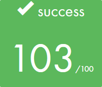

# 

# 'RT' stands for RayTracer
<br /><br />
Made from the **_end of april 2018_** to the **_end of july 2018_**. The objective of the project was to create computer generated images. It was a 4 people school project, made from scratch and entirely in C.<br /><br /><br />

## Installation

### Unix operating systems
You first need to have gtk+3 installed locally.<br />
- Linux
```
$ apt-get install libgtk-3-dev
```
- Mac _(takes a lot of time)_
```
$ brew install gtk+3
```
Then run make inside the repo.
```
$ make path/to/repo
```
### Windows and other operating systems
Not implemented.<br />

## Usage

### Launching the programm
The programm takes a scene written in json as an argument. Multiple [scenes](scenes/) are directly available in the corresponding directory.<br />
```
$ ./rt scenes/file_name.json
```
Clustering calculations are implemented. You can run the programm simultaneously on different computers as long as you're connected to the same network.<br />
- To run the programm as the host
```
$ ./rt scenes/file_name.json -host 'number of clients'
```
- To run the programm as a client _(host IP was given when running the programm as the host)_
```
$ ./rt scenes/file_name.json -client 'host IP'
```

### Keybinds
Once the programm is running, you can move with `W A S D` and rotate the camera with `I J K L`. You can enable antialiasing by pressing `O` or pixelate the display by pressing `P`. Press `ESC` to quit the programm. Those are keybinds implemented to save time searching for _that_ particular display.<br />
The **UI** allows you to use every feature efficiently.<br />

## Features
### Basics
- 4 objects : sphere, plane, cylinder, cone
- Multiple light sources
- Phong shading
- Shadows
- Translations & rotations (camera & objects)
# 

### Limited objects
- Each object can be cut on 3 different axes
- These 3 axes can be either the world axes or the object axes
- Translations & rotations are still working with cut objects
- Planes can either be cut into rectangles or circles
# 

### Refraction / Reflection
- Both have adjustable percentages
- Implementation of Snell-Descartes's indice of refraction
- A semi-transparent object has its colors projected in its shadow
# 
# 

### Textures
- Each object can have a texture put on it
- Variable scale & position
- Can use alpha channel to set the transparency of the object
- Can size the object (sets its limits)
- 24 bits & 32 bits images support
# 

### Perturbations
- Checkerboard / rainbow
- Perlin noise (classic/cosine)
- Bump mapping
# 
# 
# 
# 
# 

### User Interface
- Made with GTK+3, also displays the scene
- Can open json scenes while the programm is running
- Possibility to adjust settings of all features
- Multiple cameras (fov, position, rotation)
- Can save the current scene in a json file
- Can save the current scene in a png file
# 

### Visual effects
- Anti-aliasing (SSAA, x2 to x16)
- Cel-shading
- Depth of field
- Sepia & black and white filters
- Stereoscopy
# 
# 
# 
# 

### Lights
- Ponctual & parallel lights
- Colored lights
- Caustics
# 

### Optimization
- Pixelation
- Multi-threading
- Clustering (works with multi-threading)

# 
# 
