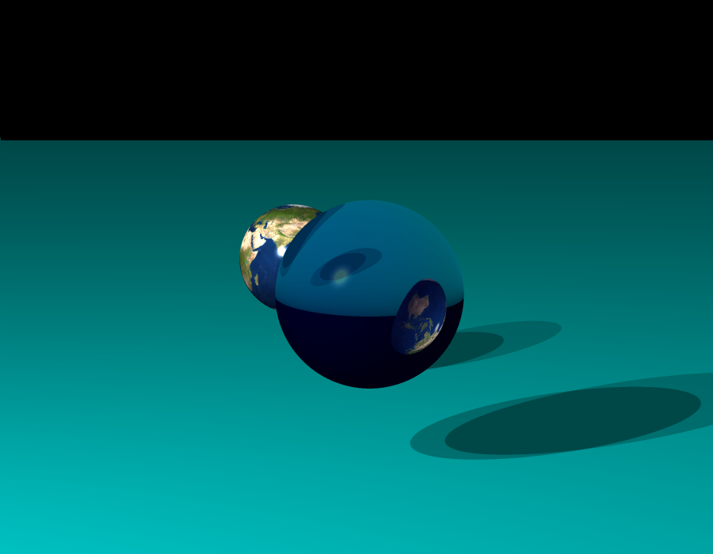

# 
## 'RT' stands for RayTracer
The objective of the project was to create computer generated images. It was a 4 people school project, made from scratch and entirely in C.

## Installing
#### Linux and Mac portability.<br>
You first need to have gtk+3 installed locally.<br>
- Linux :
```
$ apt-get install libgtk-3-dev
```
- Mac _(takes time)_ :
```
$ brew install gtk+3
```
Then run :
```
$ make
```

## Usage
The programm takes in argument a scene written in json. Multiple scenes are directly available in the directory with the same name.
```
$ ./rt 'file_name
```
Clustering calculations are implemented. You can run the programm simultaneously on different computers as long as you're connected to the same network.<br>
- To run the programm as the host :
```
$ ./rt 'file_name' -host 'number of clients'
```
- To run the programm as a client _(IP host was given when running the programm as a host)_ :
```
$ ./rt 'file_name' -client 'IP host'
```

## Features
### Basics
- 4 objects : sphere, plane, cylinder, cone
- Multiple light sources
- Phong shading
- Shadows
- Translations & rotations (camera & objects)
# 

### Limited objects
- Each object can be cut on 3 different axes
- These 3 axes can be either the world axes or the object axes
- Translations & rotations are still working with cut objects
- Planes can either be cut into rectangles or circles
# 

### Refraction / Reflection
- Both have adjustable percentages
- Implementation of Snell-Descartes's indice of refraction
- A semi-transparent object has its colors projected in its shadow
# 
# 

### Textures
- Each object can have a texture put on it
- Variable scale & position
- Can use alpha channel to set the transparency of the object
- Can size the object (sets its limits)
- 24 bits & 32 bits images support
# 
